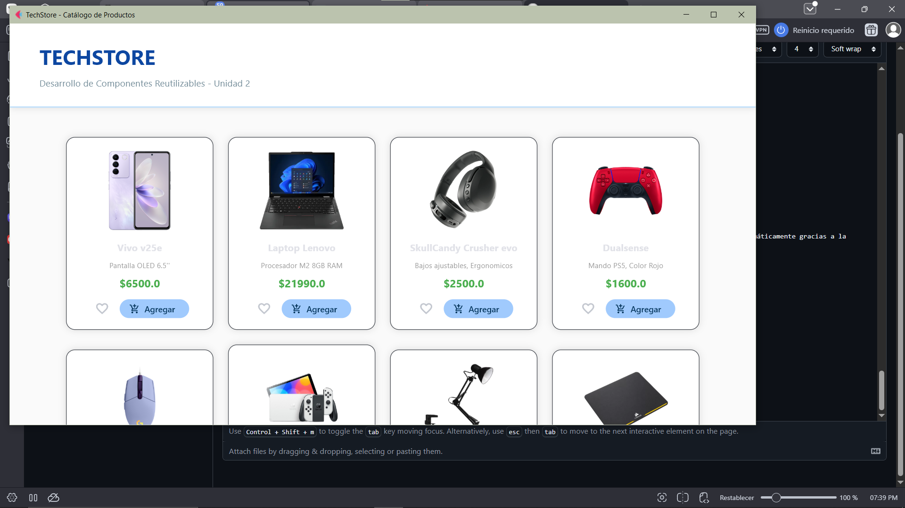
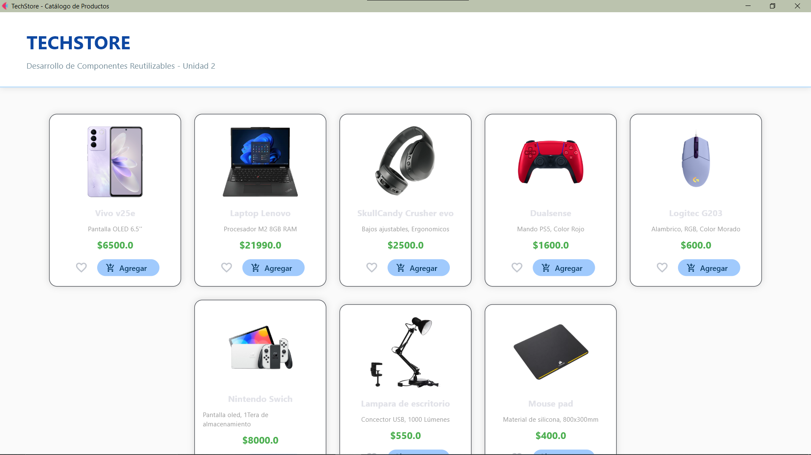
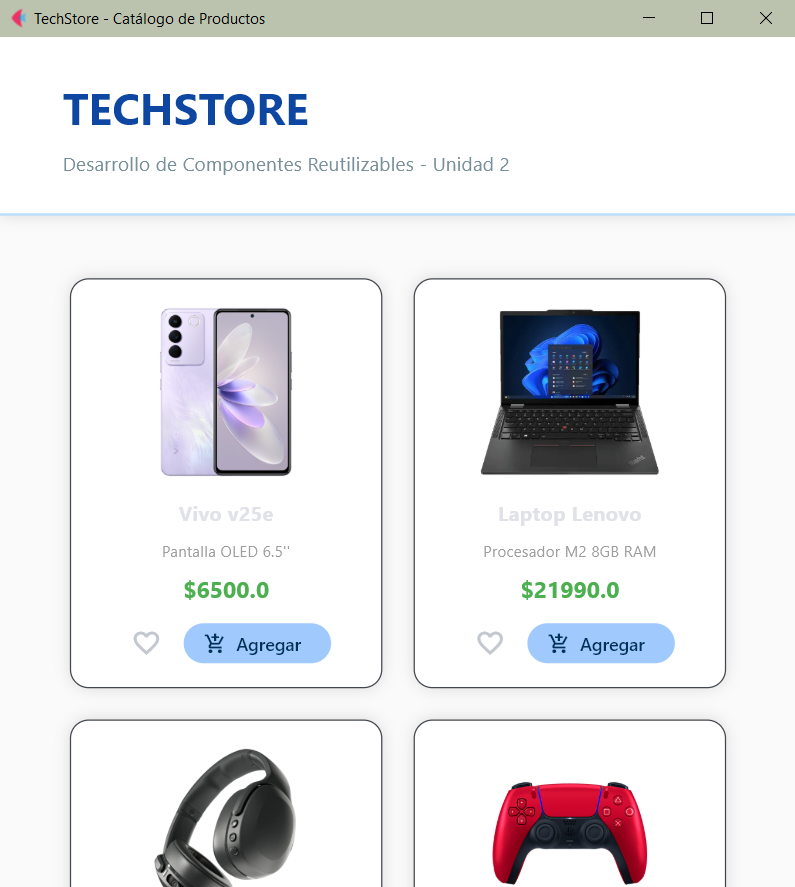

## Documentación proyecto integrador U2
Definición y Herencia

El primer paso es crear la clase que servirá como molde para todos los productos.

```python
[cite_start]class ProductoCard(ft.Container): # [cite: 12]
    def __init__(self, producto):
        [cite_start]super().__init__() # Hereda propiedades de la clase base Container [cite: 12, 28]

```

* **Qué hace:** Al heredar de `ft.Container`, nuestra clase se convierte en un control oficial de Flet que puede tener su propio estilo y comportamiento.


Configuración del Contenedor (Requisitos de Diseño)

Aquí aplicamos las reglas estéticas del proyecto.

```python
        [cite_start]self.width = 250 # Ancho fijo para uniformidad 
        [cite_start]self.border_radius = 15 # Bordes redondeados 
        [cite_start]self.shadow = ft.BoxShadow(blur_radius=10, color=ft.Colors.BLACK_12) # Sombra sutil 

```

* **Qué hace:** Garantiza que todos los productos se vean iguales.


Carga de Imágenes desde Assets

Este bloque se encarga de mostrar la foto del artículo tecnológico.

```python
        ft.Image(
            [cite_start]src=producto['imagen'], # Carga la ruta guardada en el diccionario 
            width=200, 
            height=150, 
            fit="contain" # Ajusta la imagen sin deformarla
        )

```

* 
**Qué hace:** Busca en la carpeta local `/assets` el archivo correspondiente a cada producto.


Cuerpo de Texto y Precios

Aquí renderizamos la información que el usuario necesita leer.

```python
        [cite_start]ft.Text(producto['nombre'], weight="bold"), # Título en negritas 
        [cite_start]ft.Text(producto['descripcion'], size=12), # Descripción corta 
        [cite_start]ft.Text(f"${producto['precio']}", color="green") # Precio destacado en verde 

```

* **Qué hace:** Organiza la jerarquía de información; el nombre destaca, la descripción informa y el precio resalta por su color.


Barra de Acciones (Botones)

La parte final para la interacción del usuario.

```python
        ft.Row([
            [cite_start]ft.IconButton(icon=ft.Icons.FAVORITE_BORDER), # Botón "Favorito" visual 
            [cite_start]ft.FilledButton("Agregar", icon=ft.Icons.ADD_SHOPPING_CART) # Botón de acción 
        ])

```

* **Qué hace:** Crea un área horizontal con los botones necesarios para que el componente sea funcional en una tienda real.


## Flujo de Datos: De la Lógica a la Interfaz

El sistema funciona en tres capas: **Definición** (Data Manager), **Transformación** (Custom Card) y **Visualización** (Main).

Definición en `data_manager.py`

Aquí es donde reside la "Capa de Lógica". Los datos se organizan en una estructura de lista de diccionarios.

```python
# data_manager.py
productos = [
    {
        "id": 1, 
        "nombre": "Smartphone", 
        "precio": 500.0, 
        "imagen": "celular.png"
    },
    # ... más productos
]

```

* 
**Importancia**: Esta estructura permite que cada producto sea un objeto independiente con sus propios atributos.


Importación y Mapeo en `main.py`

El archivo principal actúa como el puente. Para utilizar los datos, primero debemos "traerlos" al entorno de ejecución de la interfaz.

```python
# main.py
from data_manager import productos # Paso 1: Importar la lista de datos
from custom_card import ProductoCard # Paso 2: Importar el molde visual

def main(page: ft.Page):
    # Paso 3: Transformación de Datos en Objetos Visuales
    catalogo_grid = ft.Row(
        controls=[ProductoCard(p) for p in productos] # Bucle de instanciación
    )

```

* **¿Cómo funciona el paso de datos?**:
1. El `import` hace que la lista `productos` esté disponible en `main.py`.
2. Usamos una **comprensión de lista** (el bucle `for p in productos`) que recorre cada diccionario.
3. Para cada diccionario `p`, creamos una nueva instancia de `ProductoCard(p)`, enviándole toda la información del producto como un argumento.


Recepción en `custom_card.py`

Finalmente, la clase recibe el diccionario y lo "descompacta" para llenar los controles visuales.

```python
# custom_card.py
class ProductoCard(ft.Container):
    def __init__(self, producto): # Recibe el diccionario 'p' del main
        super().__init__()
        # Se extraen los datos mediante las llaves del diccionario
        self.content = ft.Column([
            ft.Image(src=producto['imagen']), # Toma la ruta de la imagen
            ft.Text(producto['nombre']),       # Toma el nombre
            ft.Text(f"${producto['precio']}")  # Toma el precio
        ])

```


Explicación de la Herencia

El componente personalizado diseñado para este catálogo se basa en el principio de **Herencia de Programación Orientada a Objetos (POO)**. Este concepto permite que una clase nueva adquiera todas las propiedades y métodos de una clase ya existente.

Clase Base Utilizada: `flet.Container`

Para crear el componente `ProductoCard`, se utilizó como clase base el control **`flet.Container`**.

Justificación Técnica de su Uso

La elección de `flet.Container` no fue aleatoria; se seleccionó porque proporciona la infraestructura necesaria para cumplir con los requerimientos estéticos y funcionales del proyecto:

* **Encapsulamiento de Estilo**: Al heredar de `Container`, el componente puede gestionar de forma interna sus propios bordes redondeados (`border_radius`), sombras (`shadow`) y anchos fijos, garantizando la uniformidad solicitada.


* **Contenedor de Controles**: `Container` posee la propiedad `content`, lo que permite "empaquetar" dentro de sí mismo una jerarquía compleja de otros controles (Imágenes, Textos y Botones) sin exponer esa complejidad al resto de la aplicación.


* **Modularidad y Reutilización**: Al definir el componente como una clase que hereda de Flet, el código se vuelve reutilizable. El programador no tiene que repetir el código de diseño cada vez que desea mostrar un producto; simplemente instancia la clase `ProductoCard` pasando los datos correspondientes.


Implementación en el Código

En la práctica, la herencia se declara en la cabecera de la clase y se inicializa mediante el método `super()`:

```python
# Definición de la herencia
class ProductoCard(ft.Container): 
    def __init__(self, producto):
        # Inicializa las capacidades del Container base
        super().__init__() 
        
        # Configuración de las propiedades heredadas
        self.width = 250
        self.border_radius = 15
        self.shadow = ft.BoxShadow(blur_radius=10, color=ft.Colors.BLACK_12)
        
        # Definición del contenido interno (hijo)
        self.content = ft.Column(...)

```


Gestión de Recursos

La gestión de recursos es una parte crítica del proyecto, ya que permite que la aplicación sea portable y reconozca elementos visuales externos sin depender de rutas absolutas que solo funcionen en una computadora específica.

Configuración del Directorio de Recursos (`assets`)

Para que las imágenes de los artículos tecnológicos sean reconocidas por el framework, se siguió un proceso de configuración estricto:

* **Creación de la Carpeta**: Se creó un directorio llamado `assets` en la raíz del proyecto, al mismo nivel que los archivos `.py`.


* **Almacenamiento**: Dentro de esta carpeta se guardaron todos los archivos visuales (como `DualSense.png`, `LenonoLap.webp`, etc.) requeridos por el catálogo.


Integración con Flet

El framework requiere una instrucción explícita para saber dónde buscar los archivos estáticos al momento de ejecutar la aplicación:

1. **Parámetro `assets_dir**`: En la función principal `ft.app()`, se incluyó el parámetro `assets_dir="assets"`.


2. **Mapeo Automático**: Esta configuración le indica al servidor interno de Flet que la ruta raíz para cualquier recurso visual es la carpeta mencionada, eliminando la necesidad de escribir rutas largas como `C:/Users/chr1s/...`.


Implementación en el Componente

Dentro de la clase `ProductoCard`, el control de imagen consume estos recursos de forma dinámica:

```python
# Ejemplo de carga de imagen en el componente
ft.Image(
    src=producto['imagen'], # El valor viene del Data Manager (ej: "G203.png")
    width=200,
    height=150,
    fit="contain"
)

```

* **Referencia Relativa**: El componente solo necesita el nombre del archivo y su extensión, ya que Flet completa la ruta automáticamente gracias a la gestión de recursos previamente configurada.

## Evidencias de Funcionamiento

### Vista General del Catálogo


### Detalle de Componente (Herencia de Container)


### Layout Adaptable 


---


